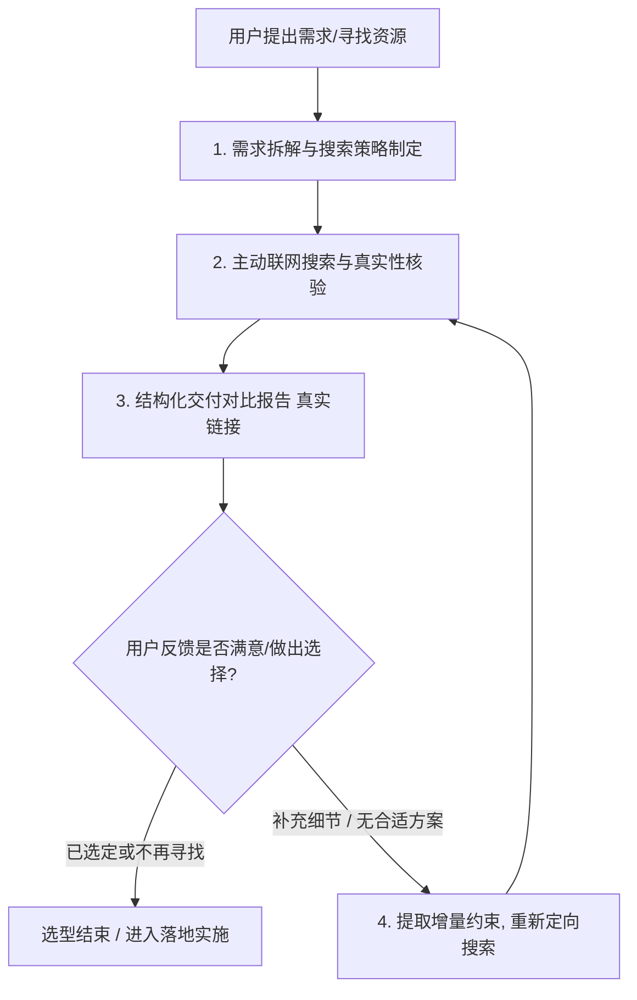

# Resource Recommendation Skill (开源资源与技术选型调研)

本技能指导 Agent 在面对用户的资源寻找、工具选型、开源库推荐等需求时，执行高质量、主动检索、真实可信（严禁编造链接）、结构化交付并闭环迭代的标准工作流。

---

## 1. 触发时机 (Trigger Scenarios)

当用户提出以下类型的问题或需求时触发本技能：
- “有没有实现 XXX 功能的库 / 工具？”
- “推荐几个好用的 XXX 开源项目 / 框架”
- “有没有类似 XXX 的替代方案？”
- “我想在项目中做 XXX，有哪些现成成熟的方案？”
- 用户对上一次推荐的资源提出进一步细化需求或表示不满意时。

---

## 2. 核心执行工作流 (Standard Workflow)



### Step 1: 需求拆解与约束提取
在搜索前，结合当前项目的上下文提取硬性与软性约束：
- **技术栈约束**：例如是否兼容 Vue 3 / Nuxt 3 / React / TypeScript。
- **环境约束**：SSR 兼容性、浏览器兼容性、Node.js 版本。
- **性能约束**：包体积大小（Zero-dependency / Tree-shakable）、运行时开销。

### Step 2: 主动联网搜索与真实性核验
**必须主动调用 `search_web` 工具** 进行多维度检索，严禁仅凭离线记忆或凭空推测：
- 检索关键词组合：`"<keyword> library github"`, `"best <keyword> alternative 2025 2026"`, `"vue 3 <keyword> component"`。
- **核验关键信息**：
  1. **官方网站 / 文档真实地址**
  2. **GitHub 仓库真实地址**（必须包含确切的 `owner/repo`）
  3. **维护状态**（近 6 个月是否有 commit / release、Star 数量级）
  4. 是否存在重大已知 Bug 或已被官方宣布 Deprecated。

### Step 3: 结构化方案交付规范（严格防虚构）
向用户推荐时，**严禁只列出名字**，必须按照以下标准卡片格式输出（每次推荐精选 **2 ~ 4 个** 最优解）：

```markdown
### 1. 库名称 (如 GSAP / vue-starport)
- **定位与一句话介绍**：简述其核心亮点。
- **🔗 官网/文档**：[官网直达链接](https://...) 或标注「无独立官网，见 GitHub Readme」
- **📦 GitHub 仓库**：[org/repo-name](https://github.com/...) (⭐ xx.xk stars) 或标注「闭源 / 仅商业版」
- **✨ 核心优势**：
  - 特性 1
  - 特性 2
- **⚠️ 潜在短板 / 注意事项**：包体积、学习曲线或兼容性边界。
- **🎯 适用场景与推荐度**：推荐度 ⭐⭐⭐⭐⭐，最适合哪种具体业务需求。
```

最后附带 **横向对比表格** 与 **针对当前项目的落地建议**。

---

## 3. 🚨 链接真实性铁律（Anti-Hallucination Rules）

> [!CAUTION]
> **绝对禁止凭空捏造、臆测或拼接网址！**

1. **真实可查才给链接**：
   - 只有在搜索结果或官方文档中**明确验证存在**的真实 URL，才允许以 Markdown 超链接格式输出。
   - 严禁自行拼凑类似 `https://github.com/xxx/xxx` 或 `https://xxx.io` 等未经检索验证的推测地址。

2. **没有地址时的如实标注规则**：
   - **若开源项目没有独立官网**：在官网栏明确注明 `无独立官网（以 GitHub Readme 为准）`，不得捏造官网域名。
   - **若属于纯官方标准/内置能力**（如 View Transitions API）：提供 MDN / W3C 权威文档地址，并在 GitHub 栏注明 `W3C 标准规范 / 浏览器原生内置`。
   - **若为商业/闭源产品**：如实标注 `闭源产品 / 商业授权`，不得伪造 GitHub 地址。
   - **若检索未果或存疑**：必须向用户坦白说明 `未检索到公开权威仓库，建议通过 npm / 官网进一步核实`。

---

## 4. 闭环迭代机制 (Continuous Feedback Loop)

当交付初版推荐后，**必须主动询问用户偏好**并保持监听状态：

1. **若用户反馈不合适 / 补充更细需求**：
   - 提取用户的**增量约束**（如：“太重了，想要纯 CSS 或 5KB 以内的”、“必须要支持中文文档”、“要能和 Tailwind 完美配合”）。
   - **立即再次发起联网深度搜索**，调整搜索策略（例如加入 `lightweight`, `micro-library`, `tailwind-plugin` 等关键词）。
   - 给出第二轮更具针对性的候选方案。

2. **终止条件**：
   - 用户明确选定了其中某个库（“就用它了”、“帮我集成第一个”）。
   - 用户明确表示不再需要寻找资源（“先不用了”、“换个思路做”）。

---

## 5. 资源质量评估红线

| 维度 | 合格标准 | 警惕红线 (尽量不推荐) |
| :--- | :--- | :--- |
| **真实性 (核心)** | 官网与 GitHub 仓库均经验证真实可访问 | 虚构链接、拼凑不存在的域名、404 死链 |
| **维护状态** | 近 6~12 个月内有更新或属于极其稳定的成熟库 | 超过 2 年未更新、Issues 堆积未处理 |
| **类型支持** | 原生提供 `.d.ts` 或有高质量 `@types/xxx` | 纯 JS 且无官方类型定义 |
| **协议安全性** | MIT / Apache-2.0 / BSD / ISC 等宽松开源协议 | GPL 传染性协议或商业受限协议（需主动注明） |
