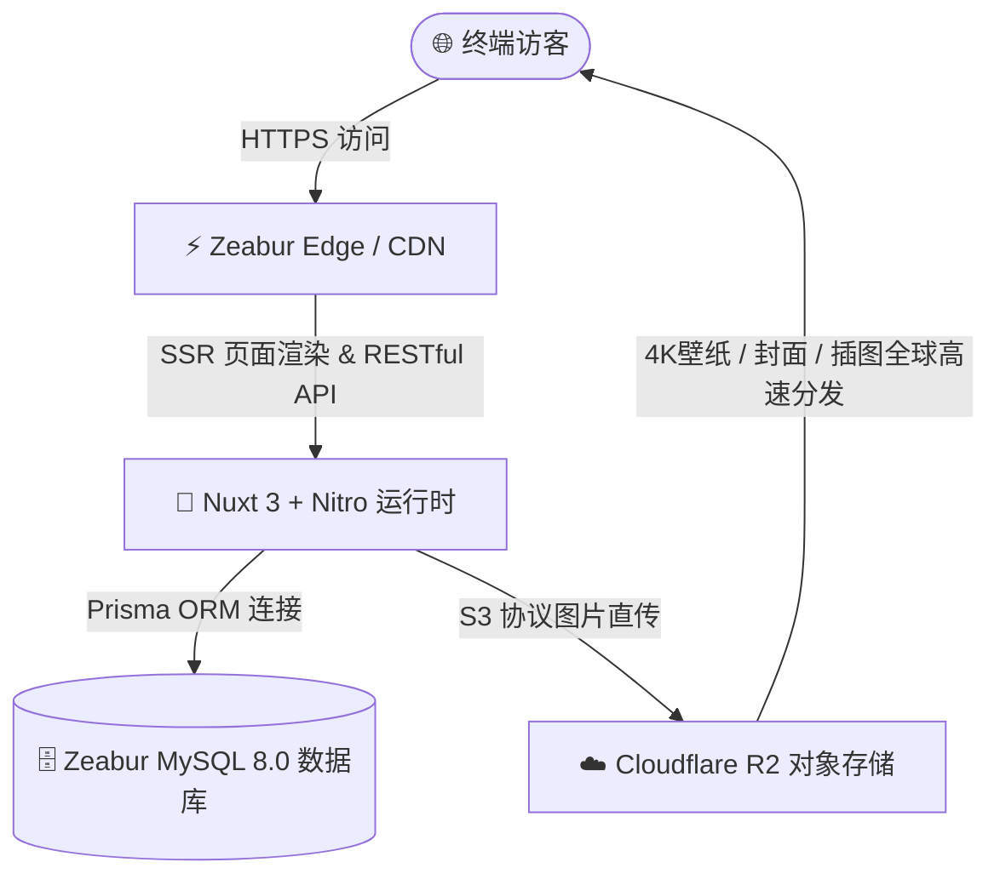

# 🚀 神秘花园 (LuoKai Garden) 部署方案指南

本指南记录了博客系统的生产环境部署方案（**Zeabur 全栈托管 + Cloudflare R2 零成本对象存储**）。通过该方案，你可以实现 **0 成本、零运维、全自动 CI/CD 部署**，并具备高防盗刷、不限出站流量的图片托管能力。

---

## 🏗️ 架构与费用总览



| 模块 | 选型服务 | 核心作用 | 费用与额度 |
| :--- | :--- | :--- | :--- |
| **前端与服务端** | **Zeabur** | 托管 Nuxt 3 SSR 页面与 Nitro API 接口 | 免费版（提供免费子域名，空闲自动休眠） |
| **数据库** | **Zeabur MySQL** | 存储文章、笔记、随笔、评论与标签数据 | 包含在 Zeabur 项目内，一键开通 |
| **对象存储 (OSS)** | **Cloudflare R2** | 托管 4K 壁纸、文章封面、正文插图与头像 | **永久 10GB 免费 + 永久 0 出站流量费（永不欠费）** |
| **域名与 SSL** | **Zeabur / Cloudflare** | 自动免费分配 HTTPS 证书与访问域名 | 完全免费 |
| **总计成本** | —— | —— | **🎉 0 元 / 永久免费** |

---

## 🛠️ 第一阶段：配置 Cloudflare R2 对象存储

Cloudflare R2 用于存储博客的所有图片资源，彻底减轻服务器带宽压力，且完全免除出站流量费。

### 1. 创建存储桶（Bucket）
1. 注册并登录 [Cloudflare 控制台](https://dash.cloudflare.com)。
2. 在左侧导航栏点击 **「R2 对象存储」** $\rightarrow$ 点击 **「创建存储桶」**。
3. 存储桶名称填入：`luokai-blog`（位置建议保持默认“自动”即可） $\rightarrow$ 点击确认创建。

### 2. 开启公开访问（Public URL）
1. 进入刚创建好的 `luokai-blog` 存储桶 $\rightarrow$ 切换到 **「设置 (Settings)」** 标签页。
2. 找到 **「公开访问权限 (Public Access)」** 区域 $\rightarrow$ 点击 **「允许访问 (Allow Access)」**。
3. 复制生成的公共访问域名（格式类似 `https://pub-xxxxxxxxxxxxxx.r2.dev`）。

### 3. 创建 R2 API 访问密钥（AK / SK）
1. 返回 R2 概览页，点击右上角的 **「管理 R2 API 令牌 (Manage R2 API Tokens)」**。
2. 点击 **「创建 API 令牌」**：
   - 权限选择：**「管理员读写 (Object Read & Write)」**。
   - 生效存储桶：选择 `luokai-blog` 或所有存储桶。
3. 创建成功后，保存以下 3 个关键信息：
   - **Access Key ID**（对应 `S3_ACCESS_KEY_ID`）
   - **Secret Access Key**（对应 `S3_SECRET_ACCESS_KEY`）
   - **管辖终结点 URL**（格式类似 `https://<AccountID>.r2.cloudflarestorage.com`，对应 `S3_ENDPOINT`）

---

## 🗄️ 第二阶段：在 Zeabur 一键开通 MySQL 数据库

1. 打开 [Zeabur 官网](https://zeabur.com)，点击 **「Login」** 并使用你的 **GitHub 账号一键登录**。
2. 点击 **「Create Project（新建项目）」**（区域建议选择离国内较近的 `Asia-East`）。
3. 点击 **「Create Service（创建服务）」** $\rightarrow$ 选择 **「Marketplace（应用市场）」**。
4. 搜索并点击 **「MySQL」** $\rightarrow$ 点击部署。
5. 部署完成后点击 MySQL 服务卡片，在 **「Connection（连接信息）」** 选项卡中复制 `DATABASE_URL`。

---

## 🌐 第三阶段：在 Zeabur 部署博客与配置环境变量

### 1. 导入 GitHub 代码
1. 在同一个 Zeabur 项目中，再次点击 **「Create Service（创建服务）」** $\rightarrow$ 选择 **「Git」**。
2. 选择你的博客代码仓库（如 `luokai-garden`）。
3. Zeabur 会自动识别为 Nuxt 3 全栈项目并初始化构建流程。

### 2. 注入环境变量（Variables）
在博客服务卡片中，切换到 **「Variables（环境变量）」** 选项卡，添加以下配置项：

```ini
# ==================== 1. 数据库与认证 ====================
DATABASE_URL="引用刚才创建的 MySQL 变量 或 填入连接字符串"
JWT_SECRET="luokai-secure-random-jwt-secret-2026"
RUN_SEED="true"

# ==================== 2. Cloudflare R2 对象存储 ====================
S3_ENDPOINT="https://<你的Cloudflare-AccountID>.r2.cloudflarestorage.com"
S3_ACCESS_KEY_ID="<你的R2-AccessKeyID>"
S3_SECRET_ACCESS_KEY="<你的R2-SecretAccessKey>"
S3_BUCKET_NAME="luokai-blog"
S3_PUBLIC_DOMAIN="https://pub-xxxxxxxxxxxxxx.r2.dev"
S3_REGION="auto"
```

> 📌 **说明**：
> - `RUN_SEED="true"` 会在首次构建成功时自动为数据库注入 10 篇文章、7 篇笔记与 19 条精选随笔测试数据。
> - 变量保存后，Zeabur 会自动触发一次重新打包部署。

---

## 🌍 第四阶段：生成访问域名与功能验证

1. 在博客服务卡片中，点击 **「Networking（网络与域名）」**。
2. 在 **Public Networking** 下方点击 **「Generate Domain（生成域名）」**。
3. 输入一个你喜欢的前缀（例如 `luokai-blog`），即可生成免费域名：
   $$\text{https://luokai-blog.zeabur.app}$$
4. **全站功能验证清单**：
   - [ ] 访问首页，确认 4K 二次元晴空壁纸、SVG 动态波浪与导航栏毛玻璃特效正常。
   - [ ] 访问 `/articles` 与 `/notes`，确认文章与笔记列表排版正常，代码高亮与目录跳转正常。
   - [ ] 访问后台登录 `/admin/login`（默认超级管理员账号：`admin` / `admin123456`，建议登录后立即修改密码）。
   - [ ] 进入文章编辑页 `/admin/articles/editor`，按 `Ctrl + V` 粘贴一张截图，验证图片是否已自动上传至 Cloudflare R2。

---

## 🌟 第五阶段：后续个性化域名绑定与进阶平移

### 1. 绑定专属个性化域名（如 `luokai.me`）
当你购买了自己的域名后：
1. **主站域名**：在 Zeabur 的 **「Networking」** 中点击 **「Custom Domain」** 填入你的域名，按提示添加 CNAME 解析即可（自动配置免费 SSL 证书）。
2. **图片加速域名**：在 Cloudflare R2 存储桶设置中绑定二级域名（如 `img.luokai.me`），并将环境变量中的 `S3_PUBLIC_DOMAIN` 更新为 `https://img.luokai.me`。

### 2. 未来平移至国内云服务器（Docker Compose）
如果后续需要国内备案或追求 20ms 极速秒开：
1. 在云服务器上安装 Docker：
   ```bash
   git clone <你的GitHub仓库地址> /www/luokai_blog
   cd /www/luokai_blog
   cp .env.example .env
   # 编辑 .env 填入 MySQL 密码与 R2 密钥
   docker compose up -d --build
   ```
2. 项目已自带完整的 [`docker-compose.yml`](./docker-compose.yml) 与生产环境入口脚本，一条命令即可完成 100% 无缝平移！
