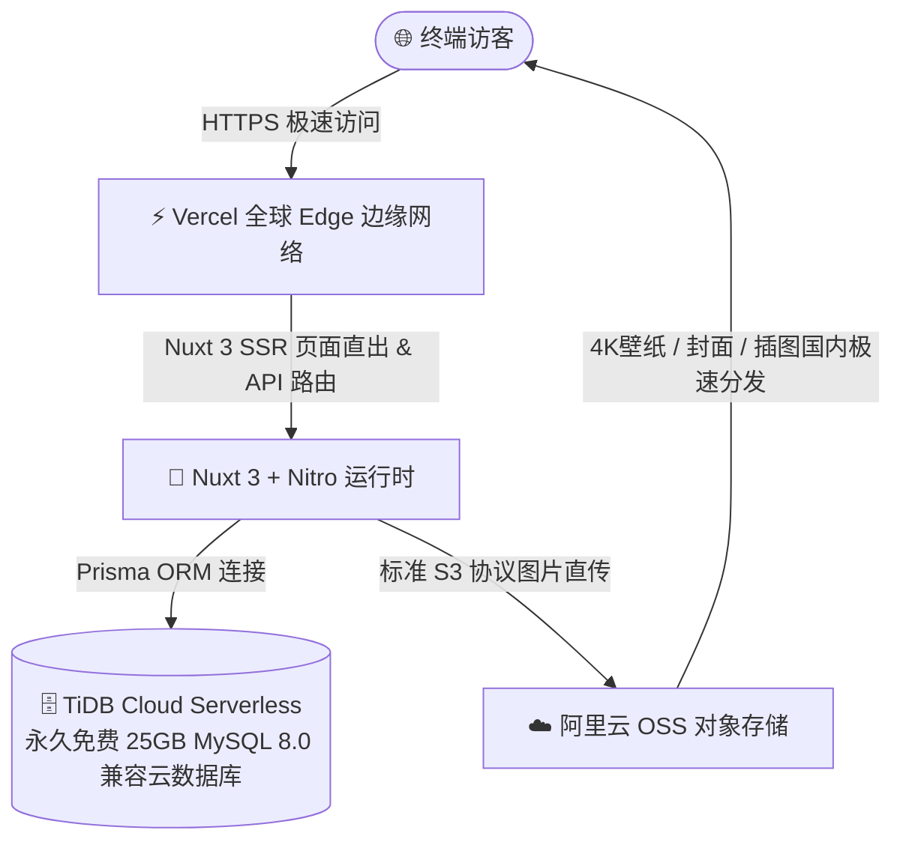

# 🚀 神秘花园 (LuoKai Garden) 部署方案指南

本指南记录了博客系统的生产环境部署方案（**Vercel 全栈托管 + TiDB Cloud 永久免费 25GB 云端 MySQL + 阿里云 OSS 对象存储**）。通过该方案，你可以实现 **0 成本（永久免费）、零服务器运维、全自动 CI/CD 极速上线**。

> 当前 ECS 生产部署使用本地持久化图片目录，而非 OSS：图片写入 `/data/luokai-blog/uploads`，由 Nginx 在 `/uploads/` 直接提供。以下 Vercel/OSS 内容仅保留为未来切换 `STORAGE_DRIVER=oss` 的参考。

## 当前 ECS 图片存储配置

部署前在服务器执行：

```bash
sudo install -d -o 1001 -g 1001 /data/luokai-blog/uploads
```

并在 `.env` 设置：

```ini
STORAGE_DRIVER="local"
UPLOAD_PUBLIC_BASE_URL="https://mysgarden.top/uploads"
```

`docker compose up -d` 会将该宿主机目录同时挂载给应用容器（写入）和 Nginx（只读公开访问）。容器镜像更新、Watchtower 重建均不会删除图片。

---

## 🏗️ 架构与费用总览



| 模块 | 选型服务 | 核心作用 | 费用与额度 |
| :--- | :--- | :--- | :--- |
| **全栈前端与服务端** | **Vercel** | 托管 Nuxt 3 SSR 页面渲染与 Nitro RESTful API | **永久 0 元（免费版）** |
| **云端数据库** | **TiDB Cloud Serverless** | 托管 MySQL 8.0 兼容数据库（文章/笔记/随笔/评论/用户数据） | **永久免费 25GB 存储空间**（无需自己装 MySQL） |
| **对象存储 (OSS)** | **阿里云 OSS** | 托管 4K 壁纸、文章封面、正文插图与头像 | 极低按量计费（约 0.5~2 元/月） |
| **自动化发布 (CI/CD)** | **GitHub + Vercel** | Git Push 代码后自动触发编译打包与热更新发布 | 完全免费 |
| **域名与 HTTPS** | **Vercel** | 自动分配 `*.vercel.app` 免费域名与自动配置 SSL | 完全免费 |

---

## 🛠️ 第一阶段：创建 TiDB Cloud 永久免费云端 MySQL（耗时约 2 分钟）

TiDB Cloud 100% 兼容 MySQL 8.0 协议，无需自己购买和安装服务器数据库，直接提供高可用的云端数据库。

### 1. 注册与创建集群
1. 打开 [TiDB Cloud 官网 (tidbcloud.com)](https://tidbcloud.com)，点击右上角 **「Sign in」**，选择 **GitHub 账号一键登录**。
2. 登录后进入控制台，点击 **「Create Cluster（创建集群）」**。
3. 集群类型选择 **「Serverless (Free)」**（永久免费 $0/月）。
4. **Region（地域）**：选择离中国大陆较近的地域（例如 `AWS / Tokyo (ap-northeast-1)` 或 `AWS / Singapore (ap-southeast-1)`）。
5. 点击 **「Create」**，等待约 10 秒钟即可完成创建！

### 2. 获取数据库连接字符串（DATABASE_URL）
1. 在刚创建好的集群详情页，点击右上角 **「Connect」** 按钮。
2. 在 **Connect with** 下拉框中选择 **「Prisma」**（或 **General**）。
3. 点击 **「Generate Password」** 生成密码并保存。
4. 复制生成的连接串（格式类似如下）：
   ```ini
   mysql://<username>.<prefix>:<password>@gateway01.<region>.prod.aws.tidbcloud.com:4000/luokai_blog?sslaccept=strict
   ```
   *这就是后续要填入 Vercel 的 `DATABASE_URL`。*

### 3. 本地同步表结构与初始种子数据（仅需执行一次）
在你的本地电脑终端中，将复制好的 TiDB 连接串临时写入本地 `.env` 的 `DATABASE_URL`，然后执行：
```bash
# 1. 自动在云端 TiDB 创建所有数据表结构
npx prisma db push

# 2. 自动导入 10 篇文章、7 篇笔记、19 条随笔初始数据
pnpm db:seed
```

---

## 🛠️ 第二阶段：配置 阿里云 OSS 对象存储

阿里云 OSS 用于存储博客的所有图片资源，彻底减轻服务器带宽压力，在国内拥有极速的加载体验。

### 1. 创建 OSS 存储桶（Bucket）
1. 注册并登录 [阿里云控制台 - OSS 对象存储](https://oss.console.aliyun.com/)。
2. 点击 **「Bucket 列表」** $\rightarrow$ 点击 **「创建 Bucket」**：
   - **Bucket 名称**：填入唯一名称（例如 `luokai-blog-img`）。
   - **地域 (Region)**：选择离你较近的国内地域（如 `华东1 (杭州)`、`华东2 (上海)`、`华南1 (广州)`、`华北2 (北京)`）。
   - **读写权限 (ACL)**：选择 **「公共读 (public-read)」**（确保访客无需签名即可公开浏览图片）。
   - **存储类型**：标准存储。
3. 点击确定完成创建。

### 2. 获取 Endpoint 与公共外链域名
进入刚创建好的 Bucket 概览页：
- **地域节点 (Endpoint)**：如 `https://oss-cn-hangzhou.aliyuncs.com`。
- **Bucket 域名**：如 `https://luokai-blog-img.oss-cn-hangzhou.aliyuncs.com`。

### 3. 创建阿里云 RAM 访问密钥（AccessKey ID / Secret）
1. 访问 [阿里云 RAM 访问控制台](https://ram.console.aliyun.com/users)。
2. 点击 **「创建用户」**（勾选 **OpenAPI 调用访问**）。
3. 创建成功后，保存好弹出的 **AccessKey ID** 与 **AccessKey Secret**。
4. 为该 RAM 用户附加自定义最小权限策略：仅允许目标 Bucket 的 `uploads/*` 执行 `oss:PutObject`；不要授予 `AliyunOSSFullAccess`、删除或列举权限。
5. 在 Bucket 的 CORS 规则中添加站点域名和本地开发地址，允许 `PUT`、`Content-Type` 请求头，并暴露 `ETag`、`x-oss-request-id`。

RAM 自定义策略示例（将 `<bucket-name>` 替换为实际 Bucket 名）：

```json
{
  "Version": "1",
  "Statement": [{
    "Effect": "Allow",
    "Action": ["oss:PutObject"],
    "Resource": ["acs:oss:*:*:<bucket-name>/uploads/*"]
  }]
}
```

---

## 🌐 第三阶段：在 Vercel 一键部署博客（耗时约 2 分钟）

### 1. 导入 GitHub 代码
1. 打开 [Vercel 官网 (vercel.com)](https://vercel.com)，点击 **「Sign Up」 / 「Log In」** 使用你的 **GitHub 账号一键登录**。
2. 点击控制台右上角的 **「Add New...」 $\rightarrow$ 「Project」**。
3. 找到并选择你的博客仓库（`luokai-garden`），点击 **「Import」**。

### 2. 注入环境变量（Environment Variables）
在部署配置页面的 **「Environment Variables」** 折叠栏中，依次填入以下环境变量：

| 变量名 (Key) | 变量值 (Value 示例) | 作用说明 |
| :--- | :--- | :--- |
| **`DATABASE_URL`** | `mysql://...:4000/luokai_blog?sslaccept=strict` | 第一阶段从 TiDB Cloud 复制的云数据库连接串 |
| **`JWT_SECRET`** | `luokai-secure-jwt-token-2026-secret-key` | 管理员登录加密密钥（任意复杂字符串） |
| **`OSS_REGION`** | `oss-cn-chengdu` | 阿里云 OSS 地域代码 |
| **`OSS_ENDPOINT`** | `https://oss-cn-chengdu.aliyuncs.com` | 阿里云 OSS 地域节点 |
| **`OSS_BUCKET`** | `luokai-blog-img` | 阿里云 OSS 存储桶名称 |
| **`OSS_ACCESS_KEY_ID`** | `LTAI5txxxxxxxxxxxxxxxx` | RAM 用户 AccessKey ID |
| **`OSS_ACCESS_KEY_SECRET`** | `xxxxxxxxxxxxxxxxxxxxxxxxxxxxxx` | RAM 用户 AccessKey Secret |
| **`OSS_PUBLIC_DOMAIN`** | `https://img.mysgarden.top` | OSS 或 CDN 的公开访问域名 |

### 3. 点击部署
- 点击页面底部的 **「Deploy」** 按钮。
- Vercel 将自动拉取依赖、生成 Prisma Client、编译 Nuxt 3 页面并全球发布（约耗时 1 分钟）。
- 部署成功后，会弹出炫彩的烟花页面，并分配一个类似 `https://luokai-garden.vercel.app` 的访问链接！🎉

---

## 🌍 第四阶段：全站功能验证清单

- [ ] 访问博客首页，确认 4K 二次元晴空壁纸、SVG 动态波浪、毛玻璃导航栏与原地伸缩搜索正常。
- [ ] 访问 `/articles` 与 `/notes`，确认文章与笔记列表排版正常，代码高亮与目录跳转顺畅。
- [ ] 访问后台登录 `/admin/login`（默认超级管理员账号：`admin` / `admin123456`，建议登录后立即修改密码）。
- [ ] 进入文章编辑页 `/admin/articles/editor`，按 `Ctrl + V` 粘贴一张截图，验证图片是否已自动上传至阿里云 OSS 并生成 Markdown 链接。

---

## 🌟 第五阶段：后续个性化域名绑定与国内网络优化

### 1. 绑定个人域名（解决国内部分网络无法直连 `*.vercel.app` 的问题）
由于 `*.vercel.app` 后缀在国内部分地区运营商可能存在解析干扰，建议花几元钱在阿里云/腾讯云买一个便宜域名（如 `.top` / `.xyz` / `.me`）：
1. 在 Vercel 项目控制台点击 **「Settings」 $\rightarrow$ 「Domains」**。
2. 输入你的域名（如 `blog.yourdomain.com` 或 `yourdomain.com`）。
3. 按照 Vercel 提示，在你的域名购买商（阿里云/腾讯云 DNS 控制台）添加一条 `CNAME` 解析记录指向 `cname.vercel-dns.com`。
4. 解析生效后，国内即可**极速秒开**！

### 2. 未来平移至国内云服务器（Docker Compose）
如果后续需要国内备案或追求 20ms 极速秒开：
1. 在云服务器上安装 Docker：
   ```bash
   git clone <你的GitHub仓库地址> /www/luokai_blog
   cd /www/luokai_blog
   cp .env.example .env
   # 编辑 .env 填入 MySQL 密码与阿里云 OSS 密钥
   docker compose up -d --build
   ```
2. 项目已自带完整的 [`docker-compose.yml`](./docker-compose.yml) 与生产环境入口脚本，一条命令即可完成 100% 无缝平移！
