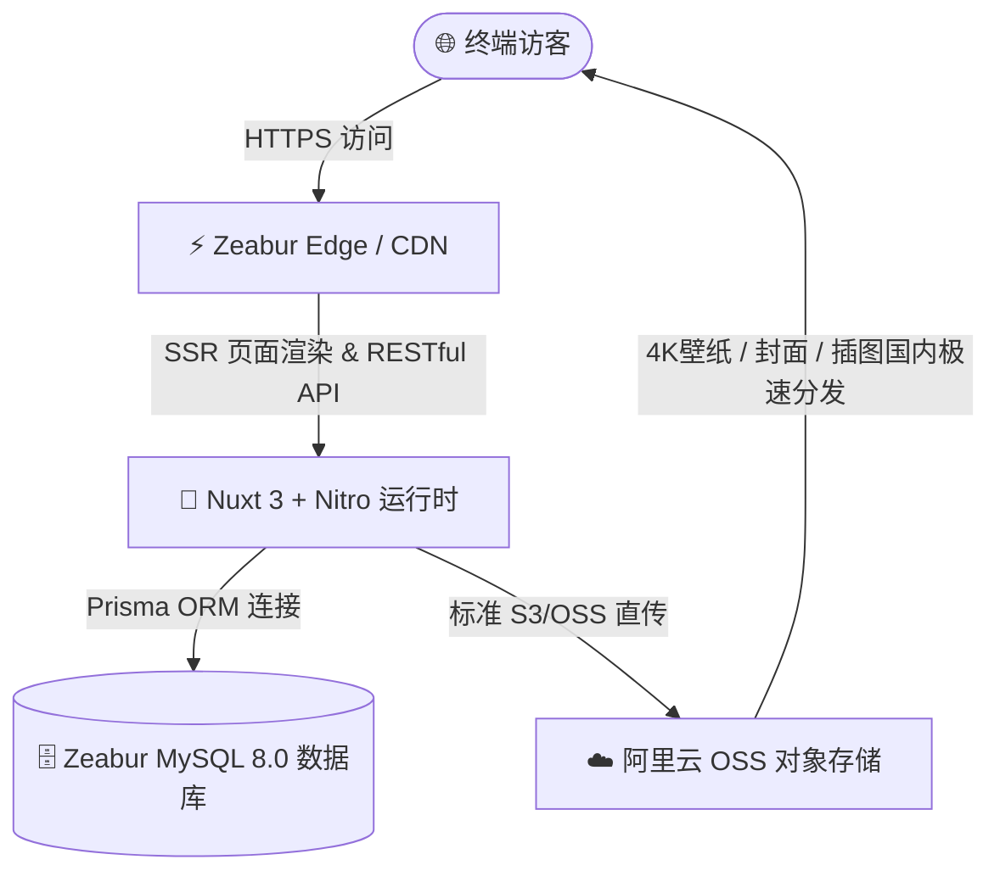

# 🚀 神秘花园 (LuoKai Garden) 部署方案指南

本指南记录了博客系统的生产环境部署方案（**Zeabur 全栈托管 + 阿里云 OSS 对象存储**）。通过该方案，你可以实现 **极低成本、国内极速访问、全自动 CI/CD 部署**，并具备高速稳定的国内图片托管能力。

---

## 🏗️ 架构与费用总览



| 模块 | 选型服务 | 核心作用 | 费用与说明 |
| :--- | :--- | :--- | :--- |
| **前端与服务端** | **Zeabur** | 托管 Nuxt 3 SSR 页面与 Nitro API 接口 | 免费版（提供免费子域名，空闲自动休眠） |
| **数据库** | **Zeabur MySQL** | 存储文章、笔记、随笔、评论与标签数据 | 包含在 Zeabur 项目内，一键开通 |
| **对象存储 (OSS)** | **阿里云 OSS** | 托管 4K 壁纸、文章封面、正文插图与头像 | 新用户免费试用，个人博客按量仅约 0.5~2 元/月 |
| **域名与 SSL** | **Zeabur** | 自动免费分配 HTTPS 证书与访问域名 | 完全免费 |

---

## 🛠️ 第一阶段：配置 阿里云 OSS 对象存储

阿里云 OSS 用于存储博客的所有图片资源，彻底减轻服务器带宽压力，在国内拥有极速的加载体验。

### 1. 创建 OSS 存储桶（Bucket）
1. 注册并登录 [阿里云控制台 - OSS 对象存储](https://oss.console.aliyun.com/)。
2. 点击 **「Bucket 列表」** $\rightarrow$ 点击 **「创建 Bucket」**：
   - **Bucket 名称**：填入唯一名称（例如 `luokai-blog-img`）。
   - **地域 (Region)**：选择离你较近的国内地域（如 `华东1 (杭州)`、`华东2 (上海)`、`华南1 (广州)`、`华北2 (北京)`）。
   - **读写权限 (ACL)**：选择 **「公共读 (public-read)」**（确保访客无需签名即可公开浏览图片）。
   - **存储类型**：标准存储。
3. 点击确定完成创建。

### 2. 获取 Endpoint 终结点与公共外链域名
进入刚创建好的 Bucket 概览页：
- **地域节点 (Endpoint)**：如 `oss-cn-hangzhou.aliyuncs.com`（接口填入 `https://oss-cn-hangzhou.aliyuncs.com`）。
- **Bucket 域名**：如 `luokai-blog-img.oss-cn-hangzhou.aliyuncs.com`（对应公共外链 `https://luokai-blog-img.oss-cn-hangzhou.aliyuncs.com`）。

### 3. 创建阿里云 RAM 访问密钥（AccessKey ID / Secret）
为了安全，建议创建 RAM 子用户并授予 OSS 权限：
1. 访问 [阿里云 RAM 访问控制台](https://ram.console.aliyun.com/users)。
2. 点击 **「创建用户」**（勾选 **OpenAPI 调用访问**）。
3. 创建成功后，保存好弹出的：
   - **AccessKey ID**（对应 `S3_ACCESS_KEY_ID`）
   - **AccessKey Secret**（对应 `S3_SECRET_ACCESS_KEY`）
4. 点击该用户的 **「添加权限」** $\rightarrow$ 搜索并添加 **`AliyunOSSFullAccess`**（管理对象存储服务 OSS 的权限）$\rightarrow$ 点击确定。

---

## 🗄️ 第二阶段：在 Zeabur 一键开通 MySQL 数据库

1. 打开 [Zeabur 官网](https://zeabur.com)，点击 **「Login」** 并使用你的 **GitHub 账号一键登录**。
2. 点击 **「Create Project（新建项目）」**（区域建议选择离国内较近的 `Asia-East`）。
3. 点击 **「Create Service（创建服务）」** $\rightarrow$ 选择 **「Marketplace（应用市场）」**。
4. 搜索并点击 **「MySQL」** $\rightarrow$ 点击部署。
5. 部署完成后点击 MySQL 服务卡片，在 **「Connection（连接信息）」** 选项卡中复制 `DATABASE_URL`。

---

## 🌐 第三阶段：在 Zeabur 部署博客与配置环境变量

### 1. 导入 GitHub 代码
1. 在同一个 Zeabur 项目中，再次点击 **「Create Service（创建服务）」** $\rightarrow$ 选择 **「Git」**。
2. 选择你的博客代码仓库（如 `luokai-garden`）。
3. Zeabur 会自动识别为 Nuxt 3 全栈项目并初始化构建流程。

### 2. 注入环境变量（Variables）
在博客服务卡片中，切换到 **「Variables（环境变量）」** 选项卡，添加以下配置项：

```ini
# ==================== 1. 数据库与认证 ====================
DATABASE_URL="引用刚才创建的 MySQL 变量 或 填入连接字符串"
JWT_SECRET="luokai-secure-random-jwt-secret-2026"
RUN_SEED="true"

# ==================== 2. 阿里云 OSS 对象存储 (S3 兼容协议) ====================
S3_ENDPOINT="https://oss-cn-hangzhou.aliyuncs.com"
S3_ACCESS_KEY_ID="<你的阿里云AccessKeyID>"
S3_SECRET_ACCESS_KEY="<你的阿里云AccessKeySecret>"
S3_BUCKET_NAME="luokai-blog-img"
S3_PUBLIC_DOMAIN="https://luokai-blog-img.oss-cn-hangzhou.aliyuncs.com"
S3_REGION="cn-hangzhou"
```

> 📌 **说明**：
> - `RUN_SEED="true"` 会在首次构建成功时自动为数据库注入 10 篇文章、7 篇笔记与 19 条精选随笔测试数据。
> - 变量保存后，Zeabur 会自动触发一次重新打包部署。

---

## 🌍 第四阶段：生成访问域名与功能验证

1. 在博客服务卡片中，点击 **「Networking（网络与域名）」**。
2. 在 **Public Networking** 下方点击 **「Generate Domain（生成域名）」**。
3. 输入一个你喜欢的前缀（例如 `luokai-blog`），即可生成免费域名：
   $$\text{https://luokai-blog.zeabur.app}$$
4. **全站功能验证清单**：
   - [ ] 访问首页，确认 4K 二次元晴空壁纸、SVG 动态波浪与导航栏原地伸缩搜索正常。
   - [ ] 访问 `/articles` 与 `/notes`，确认文章与笔记列表排版正常，代码高亮与目录跳转正常。
   - [ ] 访问后台登录 `/admin/login`（默认超级管理员账号：`admin` / `admin123456`，建议登录后立即修改密码）。
   - [ ] 进入文章编辑页 `/admin/articles/editor`，按 `Ctrl + V` 粘贴一张截图，验证图片是否已自动上传至阿里云 OSS。

---

## 🌟 第五阶段：后续个性化域名绑定与进阶平移

### 1. 绑定专属个性化域名（如 `luokai.me`）
当你购买了自己的域名后：
1. **主站域名**：在 Zeabur 的 **「Networking」** 中点击 **「Custom Domain」** 填入你的域名，按提示添加 CNAME 解析即可（自动配置免费 SSL 证书）。
2. **图片加速自定义域名**：在阿里云 OSS 的 Bucket 设置中绑定自定义域名（如 `img.luokai.me`），并将环境变量中的 `S3_PUBLIC_DOMAIN` 更新为 `https://img.luokai.me`。

### 2. 未来平移至国内云服务器（Docker Compose）
如果后续需要国内备案或追求 20ms 极速秒开：
1. 在云服务器上安装 Docker：
   ```bash
   git clone <你的GitHub仓库地址> /www/luokai_blog
   cd /www/luokai_blog
   cp .env.example .env
   # 编辑 .env 填入 MySQL 密码与阿里云 OSS 密钥
   docker compose up -d --build
   ```
2. 项目已自带完整的 [`docker-compose.yml`](./docker-compose.yml) 与生产环境入口脚本，一条命令即可完成 100% 无缝平移！
