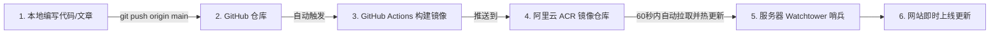
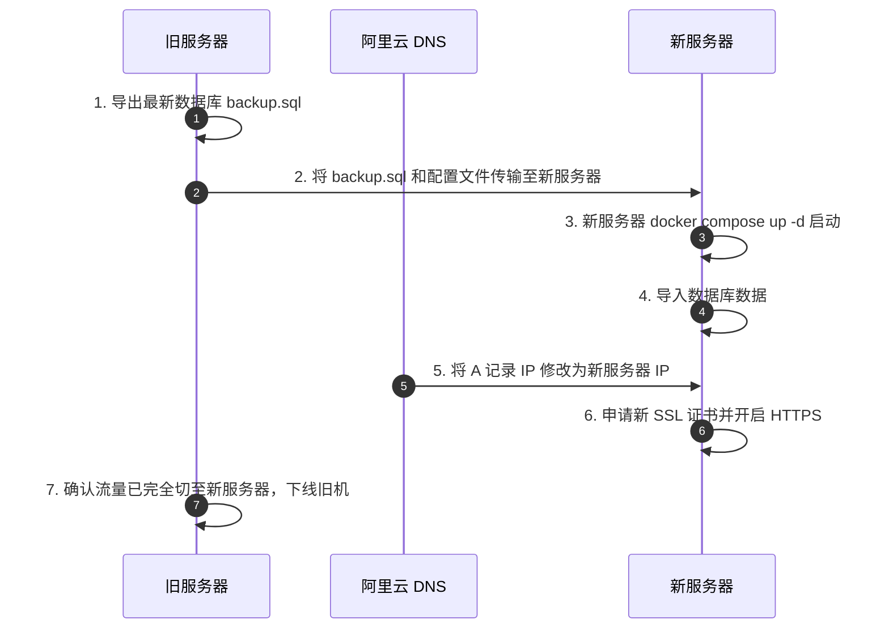

# 《神秘花园》博客全生命周期运维与迁移维护手册

> **站点域名**：`mysgarden.top` / `www.mysgarden.top`  
> **备案号**：`蜀ICP备2026049694号`  
> **技术架构**：Nuxt 3 + MySQL 8.0 + Tailwind CSS + Docker Compose + Nginx + Certbot + Watchtower + GitHub Actions

---

## 目录
- [一、日常开发与持续交付（CI/CD 流水线）](#一日常开发与持续交付cicd-流水线)
- [二、数据备份与容灾恢复（MySQL 与上传附件）](#二数据备份与容灾恢复mysql-与上传附件)
- [三、服务器迁移标准作业程序（SOP）](#三服务器迁移标准作业程序sop)
  - [3.1 场景 A：阿里云同平台更换/升级服务器](#31-场景-a阿里云同平台更换升级服务器)
  - [3.2 场景 B：跨云服务商迁移（如换到腾讯云/华为云/海外）](#32-场景-b跨云服务商迁移如换到腾讯云华为云海外)
- [四、域名管理与扩展（新增/更换域名）](#四域名管理与扩展新增更换域名)
  - [4.1 新增第二个域名（双域名共存）](#41-新增第二个域名双域名共存)
  - [4.2 彻底更换为主域名](#42-彻底更换为主域名)
- [五、SSL/TLS 证书运维与故障排查](#五ssltls-证书运维与故障排查)
- [六、工信部与公安部合规巡检维护](#六工信部与公安部合规巡检维护)
- [七、常用官方管理后台直达](#七常用官方管理后台直达)

---

## 一、日常开发与持续交付（CI/CD 流水线）

本项目已接入全自动持续部署系统，日常修改代码发布无需登录服务器。



### 1.1 极速发布命令
在本地代码仓库终端执行：
```bash
git add .
git commit -m "feat: 更新博客功能或文章"
git push origin main
```
等待约 **2~3 分钟**，刷新网页即可看到更新。

---

## 二、数据备份与容灾恢复（MySQL 与上传附件）

数据库和用户上传的图片属于持久化资产，建议每月或重大更新前进行冷备份。

### 2.1 数据库备份（导出 SQL）
在服务器终端执行：
```bash
cd /app/mystic-garden

# 导出带时间戳的完整 SQL 备份文件
docker exec luokai-mysql mysqldump -u root -pLuokaiSecureRoot2025! --default-character-set=utf8mb4 luokai_blog > backup_$(date +%Y%m%d_%H%M%S).sql
```

### 2.2 附件目录备份
```bash
# 打包上传的图片与配置
tar -czvf uploads_backup_$(date +%Y%m%d).tar.gz certbot/ nginx/
```

### 2.3 数据库恢复（灾难恢复）
如需在新机器或故障后恢复数据：
```bash
docker exec -i luokai-mysql mysql -u root -pLuokaiSecureRoot2025! luokai_blog < backup_xxx.sql
```

---

## 三、服务器迁移标准作业程序（SOP）

当服务器到期不续费、需要升级配置或更换云厂商时，按本章流程可实现 **0 停机、数据 0 丢失平滑迁移**。



---

### 3.1 场景 A：阿里云同平台更换/升级服务器

#### 步骤 1：旧服务器数据导出
```bash
# 登录旧服务器
cd /app/mystic-garden
docker exec luokai-mysql mysqldump -u root -pLuokaiSecureRoot2025! luokai_blog > /root/mystic_backup.sql
```

#### 步骤 2：在新服务器上部署环境
在新服务器终端中执行：
```bash
# 1. 安装 Docker（如果新机器未预装）
curl -fsSL https://get.docker.com | bash

# 2. 创建目录
mkdir -p /app/mystic-garden/nginx/conf.d /app/mystic-garden/certbot/conf /app/mystic-garden/certbot/www
cd /app/mystic-garden

# 3. 登录 ACR 镜像仓库
docker login --username=您的ACR用户名 crpi-81wstmjlihs5q8t3.cn-chengdu.personal.cr.aliyuncs.com

# 4. 获取 docker-compose.yml 配置文件
# 🔗 GitHub 源码链接：https://github.com/lka-top/mystic-garden/blob/main/docker-compose.yml
# 可直接从 GitHub 极速下载：
curl -o docker-compose.yml https://raw.githubusercontent.com/lka-top/mystic-garden/main/docker-compose.yml

# 5. 启动全部服务
docker compose up -d
```

#### 步骤 3：导入数据至新服务器
```bash
# 将旧服务器的 mystic_backup.sql 复制到新服务器后执行：
docker exec -i luokai-mysql mysql -u root -pLuokaiSecureRoot2025! luokai_blog < mystic_backup.sql
```

#### 步骤 4：切换 DNS 解析
1. 打开 [阿里云 DNS 控制台](https://dns.console.aliyun.com/)；
2. 将 `@` 和 `www` 的 `A 记录` 值修改为 **新服务器公网 IP**（10 秒生效）。

#### 步骤 5：新机器签发 SSL 证书
DNS 解析生效后，在新服务器执行：
```bash
cd /app/mystic-garden
docker compose run --rm --entrypoint certbot certbot certonly --webroot --webroot-path /var/www/certbot -d mysgarden.top -d www.mysgarden.top --email admin@mysgarden.top --agree-tos --no-eff-email

# 写入正式 HTTPS 配置后重载
docker compose exec nginx nginx -s reload
```

#### 步骤 6：合规信息更新
- **工信部备案**：无需重新备案（同在阿里云机房，自动放行）。
- **公安备案**：登录 [全国公安联网备案系统](https://beian.mps.gov.cn/)，在网站列表点击“变更信息”，将服务器 IP 修改为新 IP 即可。

---

### 3.2 场景 B：跨云服务商迁移（如换到腾讯云/华为云/海外）

如果您未来将服务器迁移到了 **腾讯云、华为云或火山引擎** 等其他国内厂商：

1. **新增接入备案**：
   - 登录新服务商的备案管理后台（如腾讯云备案）；
   - 点击 **【新增接入备案】**，输入您的域名 `mysgarden.top` 和现有的备案号 `蜀ICP备2026049694号`；
   - 绑定新服务商的云服务器（通常 1~2 天管局即审批完成，**原备案号保持不变**）。
2. **DNS 与 SSL 切换**：
   - 参照 3.1 步骤，在新机器拉起 Docker 容器、导入数据并重新申请 Let's Encrypt 证书。
3. **公安联网备案变更**：
   - 在公安备案系统将“网络接入服务商”由阿里云更改为对应的新云厂商。

---

## 四、域名管理与扩展（新增/更换域名）

### 4.1 新增第二个域名（双域名共存）

例如：保留 `mysgarden.top` 的同时，新增一个 `luokai.me` 也指向同一个博客。

1. **工信部新增网站备案**：
   - 在阿里云备案控制台点击 **【新增网站】**，为新域名完成备案（主体已在，审核只需 1~3 天）。
2. **DNS 解析**：
   - 在 DNS 控制台为新域名添加 `A 记录` 指向服务器 IP。
3. **扩展 Nginx 与 SSL 证书**：
   - 运行 Certbot 命令将新域名加入证书：
     ```bash
     docker compose run --rm --entrypoint certbot certbot certonly --webroot --webroot-path /var/www/certbot -d mysgarden.top -d www.mysgarden.top -d luokai.me -d www.luokai.me --expand --agree-tos
     ```
   - 在 `nginx/conf.d/app.conf` 中的 `server_name` 后面加上新域名；
   - 重载 Nginx：`docker compose exec nginx nginx -s reload`。

---

### 4.2 彻底更换为主域名

若未来彻底停用旧域名，只使用全新域名：

1. **更新博客配置**：
   - 在服务器 `docker-compose.yml` 中修改 `NUXT_PUBLIC_SITE_URL` 为新域名；
   - 执行 `docker compose up -d` 生效。
2. **清理旧备案**：
   - 在阿里云备案控制台注销旧域名的备案，避免域名到期释放后产生空壳关联。

---

## 五、SSL/TLS 证书运维与故障排查

### 5.1 自动化续期机制
- 服务器的 `luokai-certbot` 容器每 **12 小时** 会在后台自动执行一次 `certbot renew`；
- 证书剩余天数 `< 30 天` 时，系统会自动静默续期并刷新证书文件，**终身无需人工手动续费**。

### 5.2 手动强制更新测试
如果想手动测试或强制刷新证书，可执行：
```bash
docker compose run --rm --entrypoint certbot certbot renew --force-renewal
docker compose exec nginx nginx -s reload
```

---

## 六、工信部与公安部合规巡检维护

| 项目 | 周期 | 维护要求 |
| :--- | :--- | :--- |
| **网页底部备案号** | 持续保持 | 底部必须展示 `蜀ICP备2026049694号` 并超链接到 `https://beian.miit.gov.cn/`。 |
| **内容合规** | 持续保持 | 个人备案网站不能开设涉及在线交易、支付收款、开放式论坛发帖等非个人性质业务。 |
| **联系方式有效性** | 定期确认 | 备案时填报的手机号如果换号，需及时在阿里云控制台办理“变更备案主体联系方式”，防止管局抽查失联。 |
| **公安备案号悬挂** | 审核通过后 | 公安备案审批通过后，将核发的 `公网安备` 号与警徽图标放置于工信部备案号旁边。 |

---

## 七、常用官方管理后台直达

- 🌐 **阿里云 DNS 云解析控制台**：[https://dns.console.aliyun.com/](https://dns.console.aliyun.com/)
- 📋 **阿里云 ICP 代备案管理控制台**：[https://beian.aliyun.com/](https://beian.aliyun.com/)
- 🛡️ **全国公安机关互联网站安全管理服务平台**：[https://beian.mps.gov.cn/](https://beian.mps.gov.cn/)
- 📦 **阿里云容器镜像服务 ACR 控制台**：[https://cr.console.aliyun.com/](https://cr.console.aliyun.com/)
- 💻 **阿里云轻量应用服务器管理控制台**：[https://swas.console.aliyun.com/](https://swas.console.aliyun.com/)
