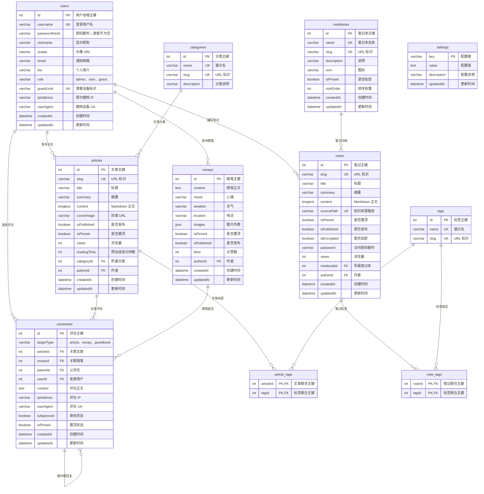

# 洛凯花园 (LuoKai Garden) · 数据库设计与 ER 关系全景图

> 本文是唯一的数据库设计文档，合并原 `luokai_blog.md`。修改 Prisma Schema 时，同时更新本文的 ER 图、表用途和字段说明。

本项目后端采用 **MySQL 8.0** 数据库，并通过 **Prisma ORM** 进行强类型模型管理。

---

## 📊 1. 数据库实体关系 (ER Diagram)

完整的矢量级高清 ER 架构图已生成并存放在项目 `public` 目录下：
👉 **[`public/database-er-diagram.svg`](/database-er-diagram.svg)**

```text
       ┌───────────────┐
       │   Category    │ (文章分类 categories)
       └───────┬───────┘
               │ 1:N
               ▼
┌──────────────┴──────────────┐   1:N   ┌───────────────┐   N:1   ┌───────────────┐
│           Article           ├────────►│  ArticleTag   │◄────────┤      Tag      │
│     (长篇博文 articles)     │         │  (中间关联表)  │         │  (全局标签)   │
└──────────────┬──────────────┘         └───────────────┘         └───────┬───────┘
               │                                                          │
           N:1 │                                                      N:1 │
               ▼                                                          ▼
┌──────────────┴──────────────┐         ┌───────────────┐   1:N   ┌───────┴───────┐
│            User             │◄────────┤    Comment    │         │    NoteTag    │
│  (博主/用户/游客 users)     │ 1:N     │  (多级楼中楼)  │         │  (中间关联表)  │
└───────┬──────────────┬──────┘         └───┬───────┬───┘         └───────▲───────┘
        │ 1:N          │ 1:N                │ 1:N   │ 1:N                 │ N:1
        ▼              ▼            ┌───────┘       └───────┐             │
┌───────┴───────┐┌─────┴────────┐   │                       │     ┌───────┴───────┐
│     Essay     ││     Note     │◄──┘                       └────►│   Notebook    │
│  (随笔灵感微言)││  (知识库笔记) │                                 │(笔记本/知识库)│
└───────────────┘└──────────────┘                                 └───────────────┘

┌───────────────┐
│    Setting    │ (站点全局动态配置，独立键值表 settings)
└───────────────┘
```

---

## 📑 2. 数据表一览与设计说明

| 数据表名 (`@@map`) | Prisma 模型 | 核心功能职责 | 关联关系 |
| :--- | :--- | :--- | :--- |
| **`users`** | `User` | 管理员账号、注册用户及免登录游客自动建档档案（支持 `guestUuid` 指纹识别） | 1:N `articles`, `essays`, `notes`, `comments` |
| **`articles`** | `Article` | 长篇深度文章（Markdown 源码、封面、阅读耗时、置顶、浏览量） | N:1 `categories`, N:1 `users`, N:M `tags`, 1:N `comments` |
| **`essays`** | `Essay` | 碎片灵感随笔（心情、天气、地点、配图 JSON、点赞数） | N:1 `users`, 1:N `comments` |
| **`notebooks`** | `Notebook` | 知识库专栏/笔记本分类（排序权重、私密状态） | 1:N `notes` |
| **`notes`** | `Note` | 结构化卡片笔记、速查代码段、访问密码保护 | N:1 `notebooks`, N:1 `users`, N:M `tags` |
| **`comments`** | `Comment` | 多态树形评论系统（支持文章/随笔/留言板，归一化关联 `User`，自引用 `parent_id` 楼中楼） | N:1 `articles`, N:1 `essays`, N:1 `users`, 自引用 `parent`/`replies` |
| **`categories`** | `Category` | 文章大类分类索引（技术、设计、生活） | 1:N `articles` |
| **`tags`** | `Tag` | 全站打通的通用技术标签与主题索引 | N:M `articles`, N:M `notes` |
| **`article_tags`** | `ArticleTag` | 文章与标签的多对多联合主键中间表 | N:1 `articles` (Cascade), N:1 `tags` (Cascade) |
| **`note_tags`** | `NoteTag` | 笔记与标签的多对多联合主键中间表 | N:1 `notes` (Cascade), N:1 `tags` (Cascade) |
| **`settings`** | `Setting` | 站点全局键值对动态配置表（标题、公告、备案号） | 独立运行时配置 |

## 3. 字段级 ER 图与维护约定

`prisma/schema.prisma` 是可执行的唯一数据模型来源；本图用于评审和维护时快速理解字段用途。新增或修改表、字段、外键时，须同步更新本图及上方表说明。


