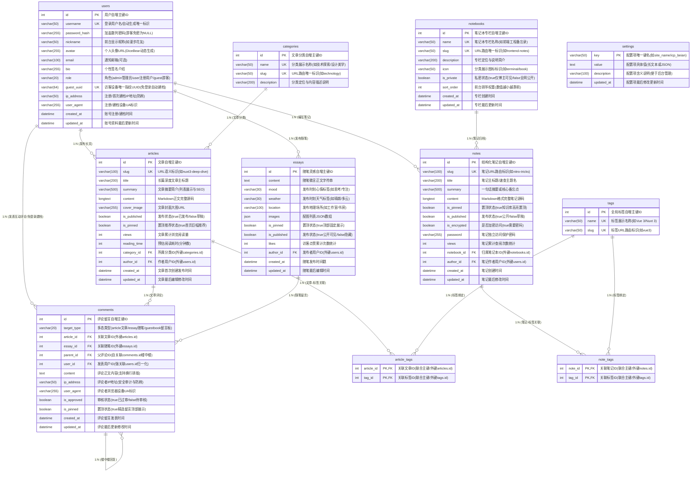

# 洛凯花园 (LuoKai Garden) · 数据库架构设计 (Mermaid ER)

> **开发规范约定**：后续所有数据库表或字段新增/变更，必须同步在本文件（[`luokai_blog.md`](luokai_blog.md)）的 Mermaid ER 图中为**每一个字段补齐精准清晰的双引号中文用途注释 (`"..."`)**，保持架构全景图的强可读性。

```mermaid
erDiagram
    users ||--o{ articles : "1:N (发布长文)"
    users ||--o{ essays : "1:N (发布随笔)"
    users ||--o{ notes : "1:N (编写笔记)"
    users ||--o{ comments : "1:N (发表互动评论/免登录建档)"

    categories ||--o{ articles : "1:N (文章分类)"
    notebooks ||--o{ notes : "1:N (笔记归档)"

    articles ||--o{ article_tags : "1:N (文章-标签关联)"
    tags ||--o{ article_tags : "1:N (标签绑定)"

    notes ||--o{ note_tags : "1:N (笔记-标签关联)"
    tags ||--o{ note_tags : "1:N (标签绑定)"

    articles ||--o{ comments : "1:N (文章评论)"
    essays ||--o{ comments : "1:N (随笔留言)"
    comments ||--o{ comments : "1:N (楼中楼回复)"

    users {
        int id PK "用户自增主键ID"
        varchar(50) username UK "登录用户名/自动生成唯一标识"
        varchar(255) password_hash "加盐散列密码(游客免密为NULL)"
        varchar(50) nickname "前台显示昵称(如漫步花友)"
        varchar(255) avatar "个人头像URL(DiceBear动态生成)"
        varchar(100) email "通知邮箱(可选)"
        varchar(255) bio "个性签名介绍"
        varchar(20) role "角色(admin管理员/user注册用户/guest游客)"
        varchar(64) guest_uuid UK "访客设备唯一指纹UUID(免登录自动建档)"
        varchar(50) ip_address "注册/首次建档IP地址(防刷)"
        varchar(255) user_agent "注册/建档设备UA标识"
        datetime created_at "账号注册/建档时间"
        datetime updated_at "账号资料最后更新时间"
    }

    categories {
        int id PK "文章分类自增主键ID"
        varchar(50) name UK "分类展示名称(如技术探索/设计美学)"
        varchar(50) slug UK "URL路由唯一标识(如technology)"
        varchar(200) description "分类定位与内容描述说明"
    }

    articles {
        int id PK "文章自增主键ID"
        varchar(100) slug UK "URL语义标识(如nuxt3-deep-dive)"
        varchar(200) title "长篇深度文章主标题"
        varchar(500) summary "文章摘要简介(列表展示与SEO)"
        longtext content "Markdown正文完整源码"
        varchar(255) cover_image "文章封面大图URL"
        boolean is_published "发布状态(true已发布/false草稿)"
        boolean is_pinned "置顶推荐状态(true首页巨幅推荐)"
        int views "文章累计浏览阅读量"
        int reading_time "预估阅读耗时(分钟数)"
        int category_id FK "所属分类ID(外键categories.id)"
        int author_id FK "作者用户ID(外键users.id)"
        datetime created_at "文章首次创建发布时间"
        datetime updated_at "文章最后编辑修改时间"
    }

    essays {
        int id PK "随笔灵感自增主键ID"
        text content "随笔微言正文字符串"
        varchar(30) mood "发布时刻心情标签(如思考/专注)"
        varchar(30) weather "发布时刻天气标签(如晴朗/多云)"
        varchar(100) location "发布地理场所(如工作室/书房)"
        json images "配图列表JSON数组"
        boolean is_pinned "置顶状态(true顶部固定展示)"
        boolean is_published "发布状态(true公开可见/false隐藏)"
        int likes "访客点赞累计次数统计"
        int author_id FK "发布者用户ID(外键users.id)"
        datetime created_at "随笔发布时间戳"
        datetime updated_at "随笔最后编辑时间"
    }

    notebooks {
        int id PK "笔记本专栏自增主键ID"
        varchar(50) name UK "笔记本专栏名称(如前端工程备忘录)"
        varchar(50) slug UK "URL路由唯一标识(如frontend-notes)"
        varchar(200) description "专栏定位与说明简介"
        varchar(50) icon "分类展示图标标识(如terminal/book)"
        boolean is_private "私密状态(true仅博主可见/false全网公开)"
        int sort_order "前台排序权重(数值越小越靠前)"
        datetime created_at "专栏创建时间"
        datetime updated_at "专栏最后更新时间"
    }

    notes {
        int id PK "结构化笔记自增主键ID"
        varchar(100) slug UK "笔记URL路由标识(如nitro-tricks)"
        varchar(200) title "笔记主标题/速查主题名"
        varchar(500) summary "一句话摘要或核心备忘点"
        longtext content "Markdown格式完整笔记源码"
        boolean is_pinned "置顶状态(true知识库高亮置顶)"
        boolean is_published "发布状态(true公开/false草稿)"
        boolean is_encrypted "是否加密访问(true需要密码)"
        varchar(255) password "笔记独立访问保护密码"
        int views "笔记累计查阅次数统计"
        int notebook_id FK "归属笔记本ID(外键notebooks.id)"
        int author_id FK "笔记作者用户ID(外键users.id)"
        datetime created_at "笔记创建时间"
        datetime updated_at "笔记最后修改时间"
    }

    comments {
        int id PK "评论留言自增主键ID"
        varchar(20) target_type "多态类型(article文章/essay随笔/guestbook留言板)"
        int article_id FK "关联文章ID(外键articles.id)"
        int essay_id FK "关联随笔ID(外键essays.id)"
        int parent_id FK "父评论ID(自关联comments.id楼中楼)"
        int user_id FK "发表用户ID(强关联users.id归一化)"
        text content "评论正文内容(支持换行排版)"
        varchar(50) ip_address "评论者IP地址(安全审计与防刷)"
        varchar(255) user_agent "评论者浏览器设备UA标识"
        boolean is_approved "审核状态(true已过审/false待审核)"
        boolean is_pinned "置顶状态(true精选留言顶部展示)"
        datetime created_at "评论留言发表时间"
        datetime updated_at "评论最后更新修改时间"
    }

    tags {
        int id PK "全局标签自增主键ID"
        varchar(50) name UK "标签展示名称(如Vue 3/Nuxt 3)"
        varchar(50) slug UK "标签URL路由标识(如vue3)"
    }

    article_tags {
        int article_id PK,FK "关联文章ID(联合主键/外键articles.id)"
        int tag_id PK,FK "关联标签ID(联合主键/外键tags.id)"
    }

    note_tags {
        int note_id PK,FK "关联笔记ID(联合主键/外键notes.id)"
        int tag_id PK,FK "关联标签ID(联合主键/外键tags.id)"
    }

    settings {
        varchar(50) key PK "配置项唯一键名(如site_name/icp_beian)"
        text value "配置项具体值(长文本或JSON)"
        varchar(100) description "配置项含义说明(便于后台管理)"
        datetime updated_at "配置项最后修改更新时间"
    }
```
